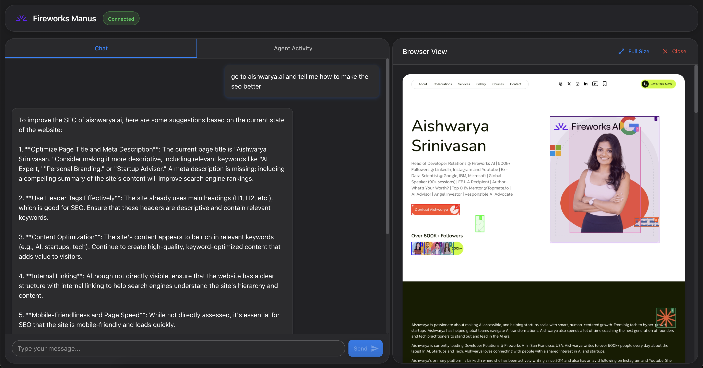
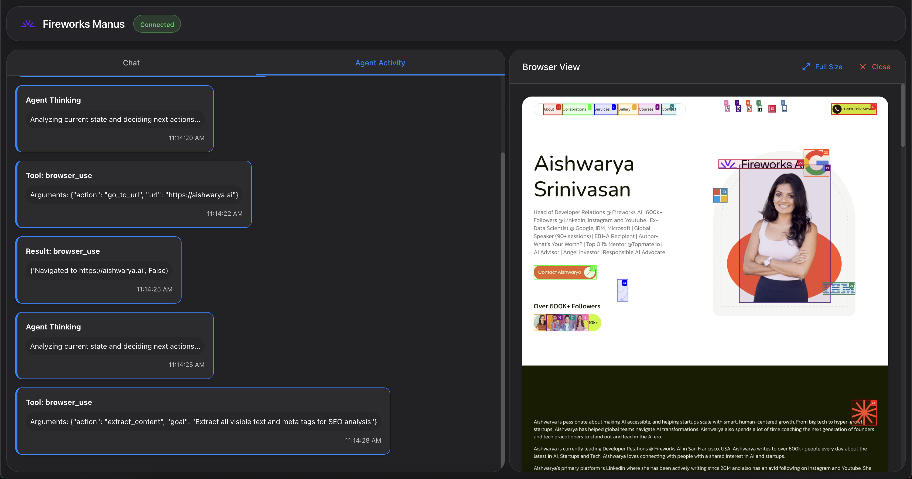

# Fireworks AI BrowserUse

A powerful AI agent for browser-based interactions powered by state-of-the-art AI models. This project is inspired by [OpenManus](https://github.com/mannaandpoem/OpenManus/) and leverages high-performance vision and language models for enhanced capabilities.

## Overview

Fireworks Manus is an AI agent that can navigate the web, extract content, analyze websites, and provide intelligent feedback based on what it sees. Using state-of-the-art models, it can understand web content both visually and textually, making it ideal for tasks like SEO analysis, content research, and web automation.




## Features

- **Web Navigation**: Visit any website and interact with its content
- **Content Extraction**: Analyze page text, structure, and visual elements
- **SEO Analysis**: Evaluate websites for search engine optimization opportunities
- **Interactive UI**: Simple interface for sending commands and viewing results
- **Enhanced Scraping**: Advanced web scraping capabilities with recursive content extraction

## Prerequisites

- Python 3.11-3.13
- Modern web browser
- Unix-based OS (macOS, Linux) or WSL for Windows
- Sufficient disk space for model downloads (at least 50GB recommended)
- GPU with CUDA support (recommended for better performance)

## Installation

### Automatic Setup (Recommended)

1. Clone the repository:
```bash
git clone https://github.com/shubcodes/fireworksai-browseruse.git
cd fireworksai-browseruse
```

2. Run the setup script:
```bash
bash scripts/setup.sh
```

This script will:
- Install required system packages
- Set up Python 3.11
- Create a virtual environment
- Install Python dependencies
- Install Playwright browsers
- Set up model cache directory
- Download required models

### Manual Setup

If you prefer to set up manually:

1. Install system dependencies:
```bash
sudo apt-get update
sudo apt-get install -y software-properties-common git libglib2.0-0 libnss3 libnspr4 libatk1.0-0 libatk-bridge2.0-0 libcups2 libdrm2 libdbus-1-3 libxkbcommon0 libxcomposite1 libxdamage1 libxfixes3 libxrandr2 libgbm1 libasound2 libpango-1.0-0 libpangocairo-1.0-0 libxcursor1 libgtk-3-0 libcairo-gobject2 libgdk-pixbuf-2.0-0
```

2. Install Python 3.11:
```bash
sudo add-apt-repository -y ppa:deadsnakes/ppa
sudo apt-get update
sudo apt-get install -y python3.11 python3.11-venv python3.11-dev
```

3. Create and activate virtual environment:
```bash
python3.11 -m venv venv
source venv/bin/activate
```

4. Install Python dependencies:
```bash
pip install -r requirements.txt
```

5. Install Playwright:
```bash
playwright install
playwright install-deps
```

6. Set up model cache:
```bash
sudo mkdir -p /ephemeral/.cache
sudo chown -R $USER:$USER /ephemeral/.cache
export HF_HOME="/ephemeral/.cache/huggingface"
```

7. Download models:
```bash
PYTHONPATH=$PYTHONPATH:$(pwd) python scripts/download_models.py
```

## Configuration

### Model Configuration

1. Create a copy of the example config file:
```bash
cp config/config.example.toml config/config.toml
```

2. Edit `config/config.toml` to configure your models:
```toml
# Global LLM configuration
[llm]
model = "Qwen/Qwen2.5-72B-Instruct"  # Or your preferred model
max_tokens = 4096
temperature = 0.0

# Vision model configuration
[llm.vision]
model = "Salesforce/blip2-flan-t5-xl"  # Vision model
```

## Starting the Application

1. Activate the virtual environment:
```bash
source venv/bin/activate
```

2. Start the server:
```bash
./start_server.sh
```

3. Start the frontend (in a separate terminal):
```bash
./start_frontend.sh
```

4. Access the UI by navigating to `http://localhost:8000` in your browser

## Usage

### Basic Web Navigation
- Visit a website: `go to https://example.com`
- Scroll down: `scroll down`
- Extract content: `extract the text from this page`

### Advanced Content Extraction
- Extract specific content: `extract all pricing information from this page`
- Recursive scraping: `scrape this page and its linked pages for product information`

### SEO Analysis
- Analyze SEO: `go to https://example.com and tell me how to improve its SEO`
- Check meta tags: `extract the meta tags from this page`
- Suggest improvements: `how can I optimize this page for search engines?`

### Content Research
- Summarize content: `summarize the main points on this page`
- Compare information: `go to these two websites and tell me their differences`
- Extract specific data: `find all pricing information on this page`

## Architecture

The application consists of several key components:

1. **Backend Server**
   - Python-based server handling agent logic
   - Browser automation and content extraction
   - Model management and caching

2. **Frontend UI**
   - Web interface for user interaction
   - Real-time command processing
   - Result visualization
   - Browser state monitoring

3. **Browser Tool**
   - Playwright-based browser automation
   - Content extraction and parsing
   - Navigation and interaction handling

4. **AI Models**
   - Qwen2.5-72B-Instruct for language understanding
   - BLIP2 for vision processing
   - 4-bit quantized models for efficient inference

## Troubleshooting

### Common Issues

1. **Model Download Issues**
   - Ensure sufficient disk space
   - Check internet connection
   - Verify HF_HOME directory permissions
   - Try clearing cache: `rm -rf /ephemeral/.cache/huggingface`

2. **Browser Automation**
   - Run `playwright install --with-deps`
   - Check browser dependencies
   - Verify GPU drivers if using CUDA

3. **Model Issues**
   - Verify model names in config.toml
   - Check model compatibility
   - Ensure correct model versions

### Performance Optimization

1. **GPU Usage**
   - Models are automatically quantized to 4-bit
   - CUDA acceleration is enabled by default
   - Adjust batch sizes in config if needed

2. **Memory Management**
   - Models are loaded with 4-bit quantization
   - Automatic device mapping for optimal memory usage
   - Cache management for downloaded models

## Contributing

Contributions are welcome! Please feel free to submit pull requests or open issues to improve Fireworks Manus.

## License

MIT License

Copyright (c) 2025 manna_and_poem (Original OpenManus Project)

Permission is hereby granted, free of charge, to any person obtaining a copy
of this software and associated documentation files (the "Software"), to deal
in the Software without restriction, including without limitation the rights
to use, copy, modify, merge, publish, distribute, sublicense, and/or sell
copies of the Software, and to permit persons to whom the Software is
furnished to do so, subject to the following conditions:

The above copyright notice and this permission notice shall be included in all
copies or substantial portions of the Software.

THE SOFTWARE IS PROVIDED "AS IS", WITHOUT WARRANTY OF ANY KIND, EXPRESS OR
IMPLIED, INCLUDING BUT NOT LIMITED TO THE WARRANTIES OF MERCHANTABILITY,
FITNESS FOR A PARTICULAR PURPOSE AND NONINFRINGEMENT. IN NO EVENT SHALL THE
AUTHORS OR COPYRIGHT HOLDERS BE LIABLE FOR ANY CLAIM, DAMAGES OR OTHER
LIABILITY, WHETHER IN AN ACTION OF CONTRACT, TORT OR OTHERWISE, ARISING FROM,
OUT OF OR IN CONNECTION WITH THE SOFTWARE OR THE USE OR OTHER DEALINGS IN THE
SOFTWARE.

---

*Fireworks Manus is not affiliated with OpenManus. It is an independent project leveraging these technologies.*
